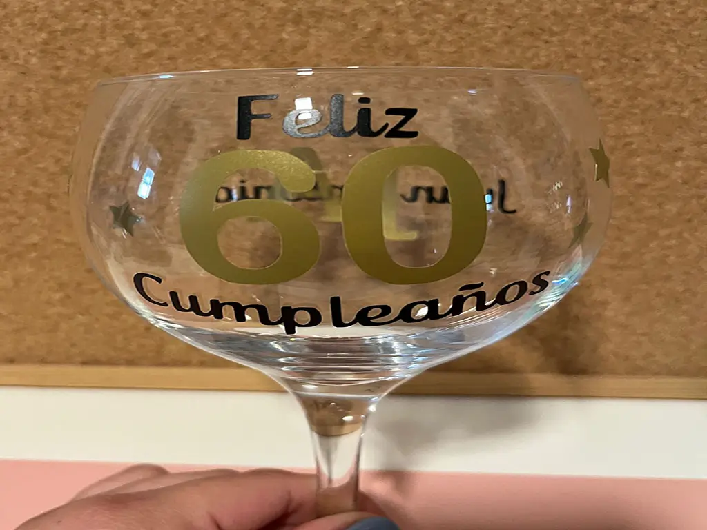
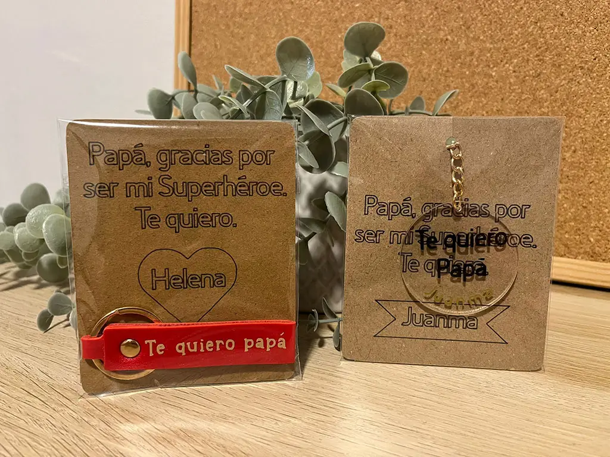
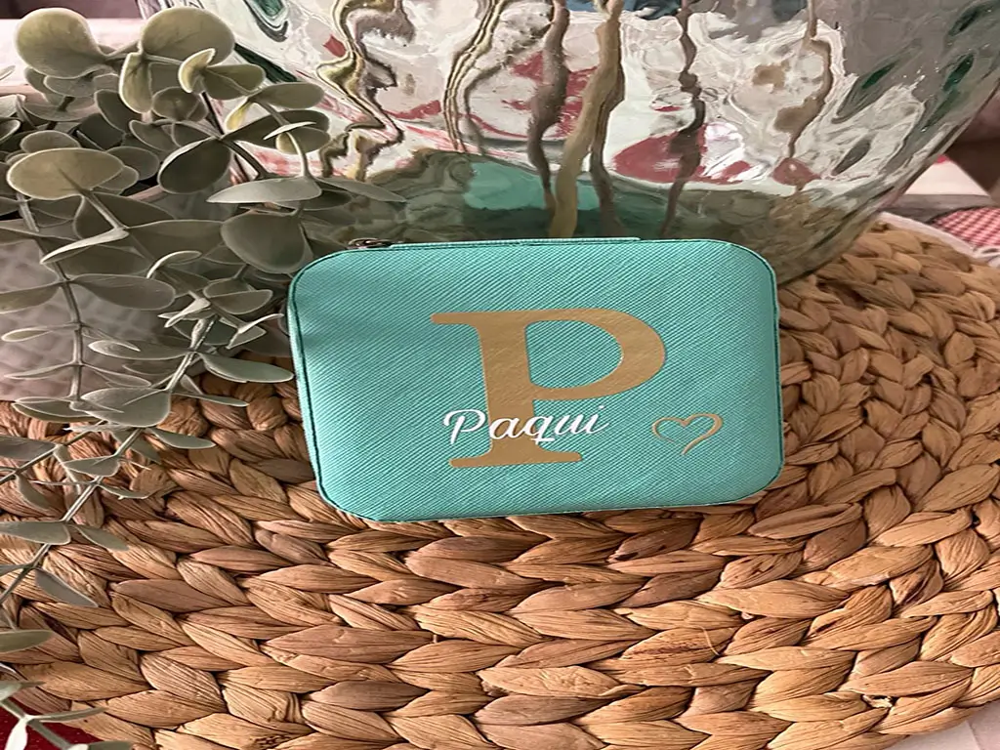
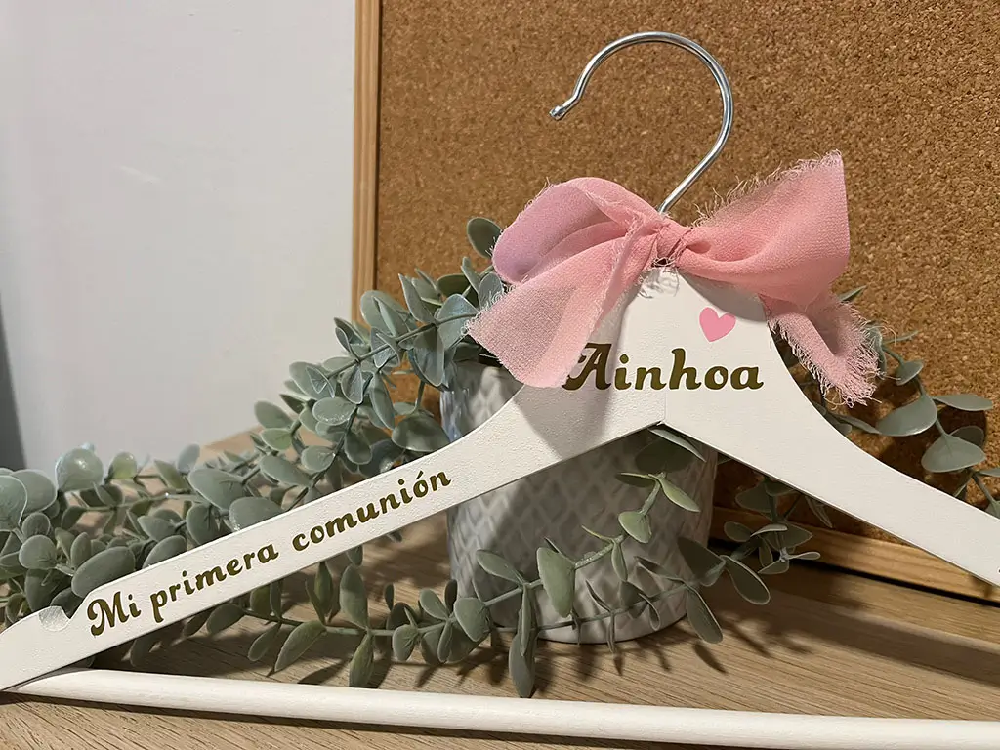
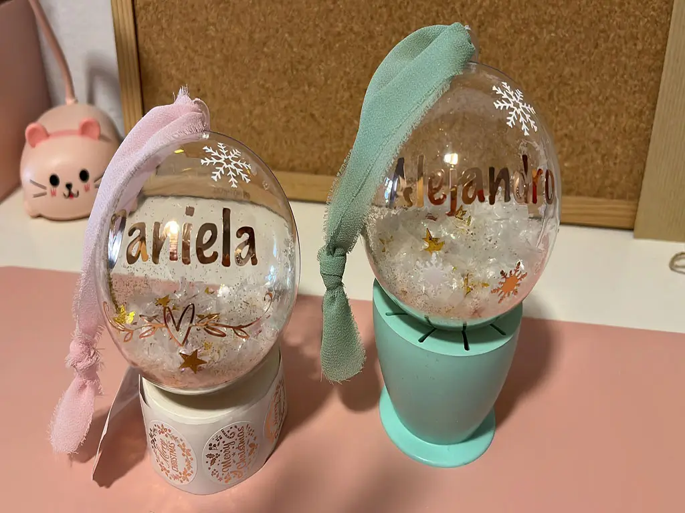
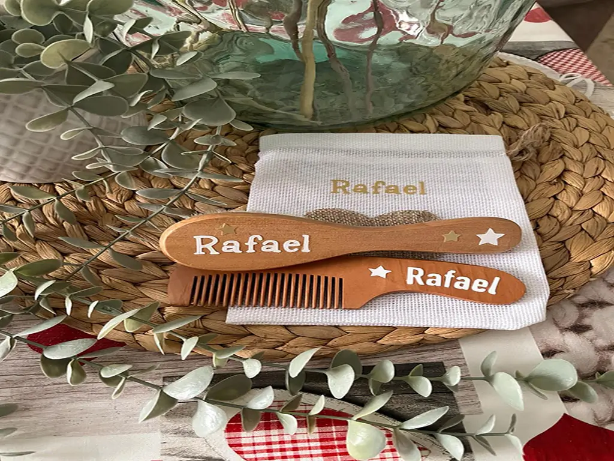

<div align="center">

# ✨ ConhdeHelena ✨
### *El arte de crear magia en cada detalle*

[Sitio Web](https://github.com/jukk4p/ConHdeHelena) • [Contacto WhatsApp](https://wa.me/34600000000)

---

[](https://nextjs.org/)
[](https://react.dev/)
[](https://tailwindcss.com/)
[](https://threejs.org/)
[](https://framer.com/)

</div>

---

## 🌸 Filosofía de la Marca

**ConhdeHelena** es un taller artesanal ubicado en el corazón de **Sevilla**, donde transformamos objetos cotidianos en recuerdos eternos. Cada pieza se diseña, graba y personaliza a mano, fusionando técnicas tradicionales con acabados modernos de alta calidad. 

> *No hacemos regalos en serie, creamos emociones a medida.*

---

## 🛍️ Nuestro Catálogo de Productos

| Producto | Vista Previa | Categoría | Precio | Detalles Clave |
| :--- | :---: | :---: | :---: | :--- |
| **Copa Personalizada** |  | Eventos | **15€** | Cristal de alto brillo, grabado en vinilo metálico premium. |
| **Llavero Personalizado** |  | Día a día | **10€** | Cuero genuino y remaches en bronce envejecido. |
| **Joyero Personalizado** |  | Especiales | **30€** | Piel sintética suave, interior de terciopelo y foil dorado. |
| **Percha de Comunión** |  | Comuniones | **15€** | Madera maciza lacada en blanco con lazo de gasa artesanal. |
| **Bolas de Navidad** |  | Temporada | **15€** | Esfera acrílica transparente rellena de nieve o purpurina. |
| **Peine Personalizado** |  | Cuidado | **15€** | Set de peine y cepillo de madera natural con bolsa de algodón. |

---

## 🛠️ Características del Desarrollo

- **Visuales Premium (3D)**: Implementación de un modelo interactivo 3D en el *Hero* utilizando `@react-three/fiber` y `@react-three/drei`, complementado con un sistema cinemático de partículas que simula polvo mágico.
- **Micro-interacciones**: Transiciones fluidas y efectos hover controlados con **Framer Motion** y vanilla CSS.
- **Rendimiento Impecable**: Estructura optimizada para Next.js con carga diferida de elementos 3D complejos y uso del formato WebP para todas las imágenes.
- **Optimización Local SEO**: Archivos con metadatos estructurados en formato **JSON-LD** (`LocalBusiness`) para garantizar un posicionamiento óptimo en búsquedas de Sevilla y alrededores.
- **Pasarela de Pedidos WhatsApp**: Modales interactivos que generan mensajes automatizados detallando el producto y la personalización deseada directamente al taller.

---

## 🚀 Instalación y Despliegue Local

Asegúrate de tener instalado [Node.js](https://nodejs.org/) (versión 18 o superior).

```bash
# 1. Clonar el repositorio
git clone https://github.com/jukk4p/ConHdeHelena.git

# 2. Entrar en la carpeta
cd ConHdeHelena

# 3. Instalar dependencias
npm install

# 4. Iniciar servidor de desarrollo
npm run dev
```

El servidor estará disponible en [http://localhost:3000](http://localhost:3000).

---

## 📁 Estructura Principal del Proyecto

```yaml
ConHdeHelena/
├── public/
│   └── images/
│       ├── assets/       # Galería de imágenes WebP reales de productos
│       └── headers/      # Encabezados visuales de las secciones
├── src/
│   ├── app/              # Rutas principales y páginas de Next.js
│   ├── components/
│   │   ├── home/         # Escenas 3D y componentes de la página de inicio
│   │   ├── layout/       # Cabecera, pie de página y elementos comunes
│   │   ├── seo/          # Scripts de datos estructurados para Google (JSON-LD)
│   │   └── shop/         # Modales y botones de pedidos interactivos
```

---

<div align="center">
Hecho a mano con amor y código en Sevilla. ✨
</div>
